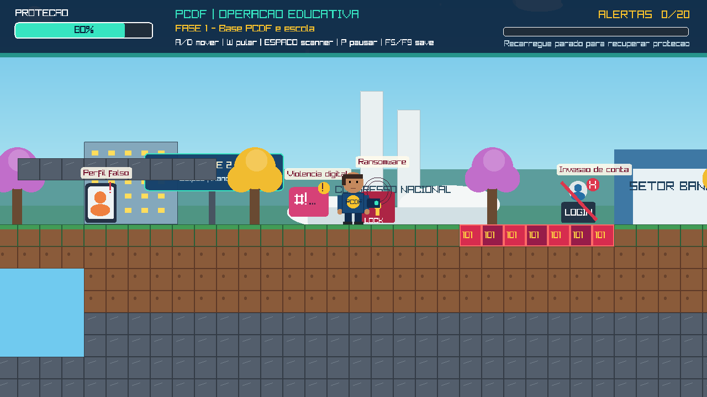

# PCDF: Missão Cibersegura

<p align="center">
  
</p>

<p align="center"><em>Captura integral do protótipo em 1280 × 720.</em></p>

Jogo educativo 2D em C e raylib para adolescentes conectados à Internet. O jogador integra uma equipe fictícia de investigação digital no Distrito Federal, percorre uma Brasília cartunesca e usa um scanner — nunca armas — para investigar 12 ocorrências. A missão só termina quando todos os alertas são identificados e suas orientações de prevenção são lidas.

> Projeto acadêmico e educativo fictício. Não é um produto oficial, não representa posicionamentos e não utiliza símbolos oficiais da Polícia Civil do Distrito Federal.

## Objetivo educativo

O público aprende a reconhecer phishing, malware, perfis falsos, ransomware, golpes de pagamento e QR Code, violência digital e invasão de contas. Cada ocorrência explica como reconhecer o risco, reduzir a exposição, preservar evidências e procurar ajuda.

## Controles

| Ação | Tecla |
|---|---|
| Mover | `A`/`D` ou setas |
| Pular | `W` ou seta para cima |
| Usar scanner | `Espaço` |
| Registrar orientação | `Enter` |
| Pausar | `P` ou `Esc` |
| Salvar / carregar | `F5` / `F9` |
| Capturar tela | `F12` |

## Compilação no Windows

Com a raylib instalada em `C:\raylib`:

```powershell
scripts\compilar-windows.bat
```

Alternativamente, com CMake e raylib disponíveis:

```powershell
cmake -S . -B build
cmake --build build
```

## Estrutura

```text
missao-cibersegura-df/
├── src/                  # Implementação do jogo
├── include/              # Interfaces, tipos e configurações
├── assets/screenshots/   # Evidências visuais
├── docs/                 # Artefatos do produto e da engenharia
├── presentation/         # Apresentação para a banca
├── scripts/              # Automação de compilação
└── .github/              # Templates e governança
```

Consulte o [índice de artefatos](docs/README.md).

## Inteligência artificial utilizada

O desenvolvimento e a documentação tiveram assistência do **OpenAI Codex, baseado no modelo GPT-5**. A IA apoiou modularização, geração e revisão de código, conteúdo educativo, documentação e apresentação. O executável não contém modelo de IA, não chama APIs de IA e funciona localmente. Leia [Uso responsável de IA](docs/ai/uso-de-inteligencia-artificial.md).

## Status do projeto

- Protótipo acadêmico funcional para Windows, validado com raylib 6.0.
- 12 ocorrências distribuídas em 7 categorias de risco.
- Persistência em arquivo local, sem coleta de dados pessoais.
- Próximo marco: testes com adolescentes e validação especializada do conteúdo.

Leia [SECURITY.md](SECURITY.md) e [CONTRIBUTING.md](CONTRIBUTING.md) antes de publicar vulnerabilidades ou propor mudanças.
