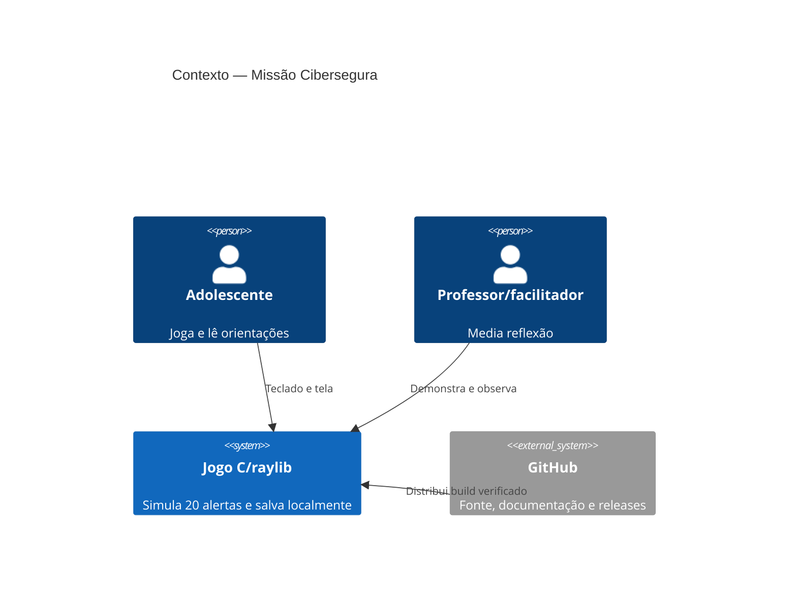
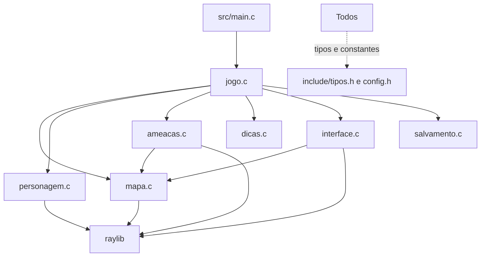
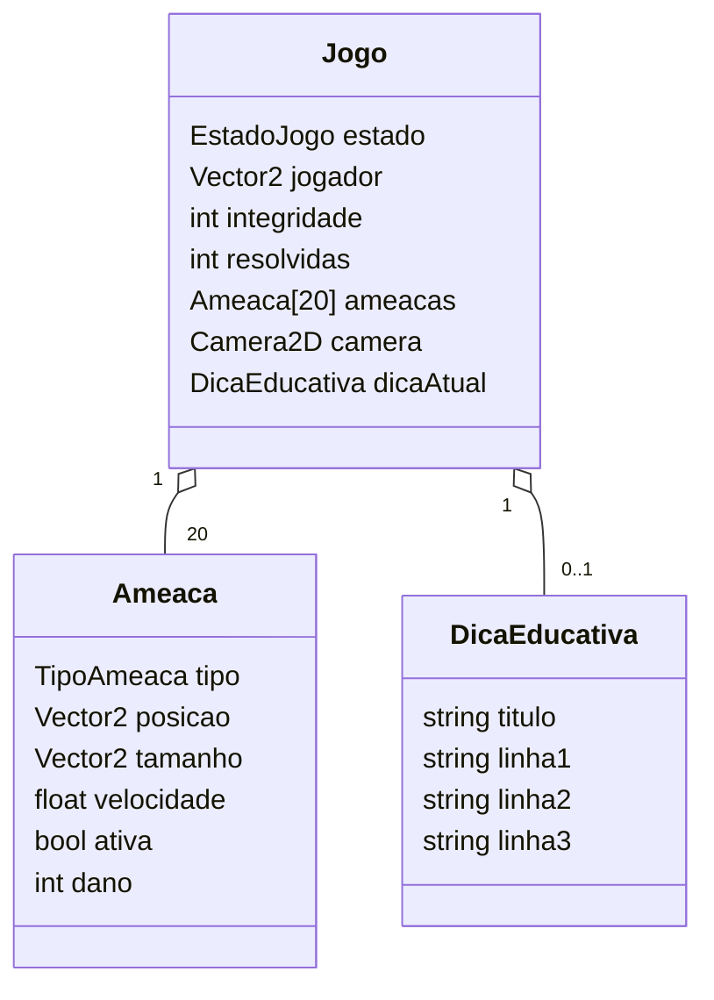
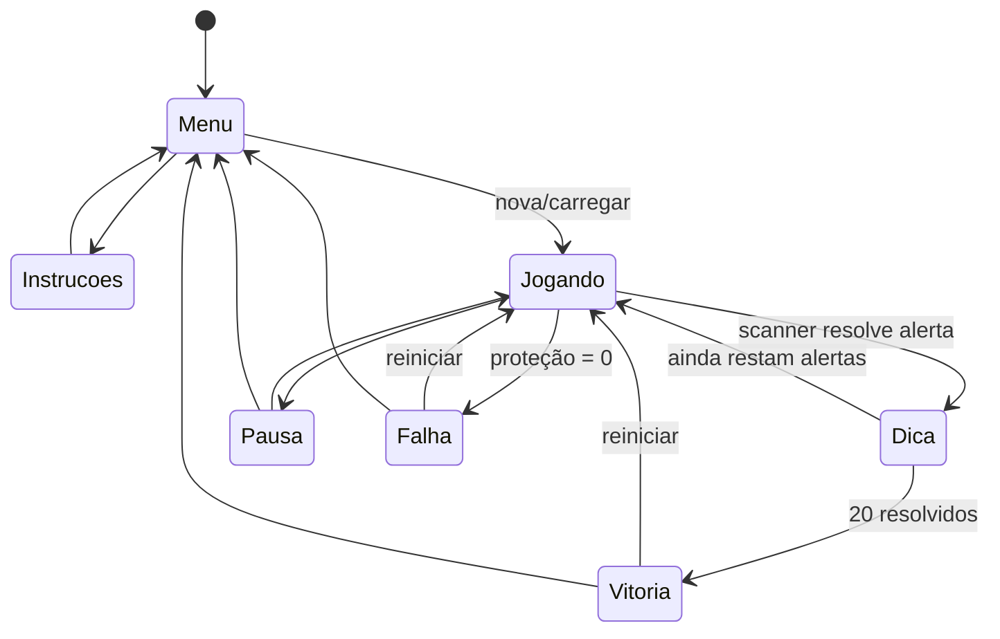
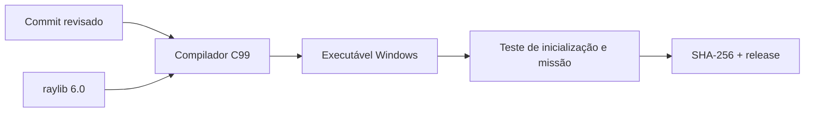

# Arquitetura do Projeto

## 1. Visão geral

Aplicação desktop 2D, single-player e offline, implementada em C99 com raylib. O desenho modular separa ciclo de vida, regras, mapa/física, ameaças, personagem, UI, conteúdo educativo e persistência. Não há rede, banco de dados ou IA em runtime.

## 2. Contexto



## 3. Componentes



| Módulo | Responsabilidade | Não deve assumir |
|---|---|---|
| `main` | janela, FPS, iniciar/encerrar | regras ou telas |
| `jogo` | estado global, input, update/draw e transições | detalhes de desenho de cada entidade |
| `mapa` | tilemap, colisão, gravidade e cenário | progresso educativo |
| `personagem` | render do agente e scanner | input e dano |
| `ameacas` | tipos, desenho, IA simples e hitbox | estado de menu/save |
| `dicas` | conteúdo por categoria | layout da UI |
| `interface` | menus, HUD, modais e resultado | física e persistência |
| `salvamento` | serialização local versionada | renderização |

Dependência aceita: módulos específicos dependem de `tipos.h`/`config.h`; `jogo` orquestra. Dependência proibida: módulos chamando `main`, UI alterando física ou conteúdo educativo acessando arquivo.

## 4. Modelo de domínio



Categorias: phishing, malware, perfil falso, ransomware, golpe de pagamento, violência digital, invasão de conta, vazamento de dados, engenharia social, Wi-Fi falso, loja falsa, deepfake/IA, doxxing, suporte falso e aliciamento online.

## 5. Estados e fluxo



Por quadro: coletar input → atualizar física/ameaças → detectar scanner/dano → atualizar estado/câmera → desenhar mundo → desenhar UI. Enquanto uma dica está aberta, o mundo fica congelado para garantir tempo de leitura.

## 6. Persistência

Arquivo `missao_pcdf_save.txt`, versão `PCDF_SAVE_V2`, gravado no diretório de execução. Contém posição, integridade, progresso e estado/posição das ameaças. Não contém nome, conta, IP ou conteúdo pessoal.

Limitações atuais: formato textual sem checksum; escrita não atômica; parser baseado em `fscanf`; save não persiste configurações de acessibilidade. Evolução: gravar em arquivo temporário, validar todos os limites, renomear atomicamente, incluir checksum de integridade e testes/fuzzing. Checksum detecta corrupção acidental, não evita edição pelo usuário — e isso é aceitável em jogo offline sem ranking.

## 7. Qualidades arquiteturais

| Qualidade | Estratégia | Evidência/pendência |
|---|---|---|
| Manutenibilidade | módulos e headers pequenos | `main.c` com 13 linhas antes da reorganização |
| Portabilidade | C99 + raylib | Windows validado; web planejada |
| Desempenho | 60 FPS, primitivas 2D, culling de tiles | validar em hardware escolar |
| Segurança | sem rede/dados; parser versionado | reforçar atomicidade e limites |
| Testabilidade | regras centralizadas | extrair núcleo sem raylib é backlog P1 |
| Acessibilidade | UI consistente e leitura controlada | remapeamento/alto contraste pendentes |
| Observabilidade | logs da raylib no build técnico | produção deve evitar dados pessoais |

## 8. Build e distribuição



Build local: `scripts/compilar-windows.bat` ou CMake. Binários não entram no Git; releases devem anexar executável, licença aplicável, hash e notas.

## 9. Arquitetura cloud futura

Para navegador, substituir o `while` bloqueante por callback compatível com `emscripten_set_main_loop`, compilar com raylib/WebAssembly e adaptar save ao IndexedDB/localStorage. O pacote HTML/JS/WASM permanece estático e pode ser publicado por CDN sem backend. Detalhes em `docs/cloud/plano-de-instanciamento-cloud.md`.

## 10. ADRs

### ADR-001 — C e raylib

**Decisão:** manter C99/raylib. **Motivo:** requisito acadêmico, baixo overhead e transparência do loop. **Consequência:** acessibilidade web e layout de texto exigem trabalho explícito.

### ADR-002 — Scanner em vez de arma

**Decisão:** resolver ameaças com scanner. **Motivo:** coerência educativa e público adolescente. **Consequência:** feedback precisa comunicar investigação, não combate.

### ADR-003 — Sem backend no MVP

**Decisão:** execução e save locais. **Motivo:** reduz custo, superfície de ataque e tratamento de dados. **Consequência:** sem sincronização ou analytics individual.

### ADR-004 — Conteúdo separado do layout

**Decisão:** `dicas.c` fornece conteúdo e `interface.c` renderiza. **Motivo:** revisão textual independente. **Consequência:** futuro ideal é carregar conteúdo versionado e validado, sem permitir código remoto.

## 11. Estrutura física

```text
src/               implementação C
include/           contratos e configuração
assets/            evidências visuais
docs/              produto e engenharia
presentation/      material da banca
scripts/           build local
.github/           governança e templates
```
