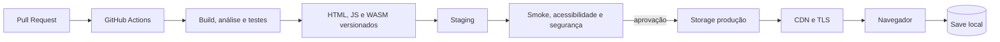

# Plano de Instanciação em Cloud

## 1. Objetivo

Publicar o jogo em navegador com baixo custo, sem login, backend ou coleta de dados. O alvo é um pacote estático HTML/JavaScript/WebAssembly, armazenado como objeto e entregue por CDN.

## 2. Gap técnico

O build Windows usa loop bloqueante. Para WebAssembly será necessário:

1. usar callback compatível com `emscripten_set_main_loop`;
2. compilar raylib e código com Emscripten;
3. adaptar save para IndexedDB/localStorage;
4. testar teclado, foco, fullscreen e canvas;
5. criar shell HTML acessível e metadados;
6. aplicar MIME/cache corretos para `.wasm`.

## 3. Arquitetura alvo

Não há banco, API, função serverless ou conta do jogador. Essa ausência é decisão de segurança e custo.

## 4. Opções

| Opção | Uso | Vantagem | Atenção |
|---|---|---|---|
| GitHub Pages | banca | simples e integrado | headers/ambientes limitados |
| Cloudflare Pages | MVP | CDN e previews por PR | nova governança de conta |
| Azure Storage + Front Door | cliente Microsoft | RBAC e integração | configuração/custo maiores |
| S3 + CloudFront | cliente AWS | maturidade e IaC | políticas/cache exigem experiência |

Recomendação: Pages para demonstração; storage + CDN do provedor do cliente em produção. Validar preços nas calculadoras oficiais no momento da contratação.

## 5. Ambientes e pipeline

| Ambiente | Gatilho | Retenção | Dados |
|---|---|---|---|
| Preview | pull request | até fechar PR | nenhum |
| Staging | merge em `main` | últimas 5 versões | nenhum |
| Produção | tag + aprovação | releases/rollback | nenhum |

Pipeline: checkout read-only; validação de segredo/Markdown; builds nativo e web; testes/análise; SBOM e hashes; deploy staging; smoke/headers/acessibilidade; aprovação; promoção do mesmo artefato; verificação pós-deploy. Usar OIDC temporário, não chaves estáticas.

## 6. Segurança e operação

- TLS e redirecionamento HTTPS;
- CSP restritiva, `nosniff`, `Referrer-Policy`, `Permissions-Policy` e anti-framing;
- origem privada quando suportado e permissões mínimas;
- cache longo para assets com hash e curto para HTML;
- logs mínimos, sem identificadores do jogo;
- alerta de erro de deploy, indisponibilidade e orçamento;
- rollback para artefato anterior, sem reconstrução.

SLO inicial: 99,5% de disponibilidade mensal para piloto; carregamento inicial alvo abaixo de 5 s em conexão escolar de referência; erro de asset abaixo de 1%. São metas a validar, não compromisso contratual.

## 7. Capacidade e custos

Modelo simples: `custo ≈ armazenamento + requisições + tráfego de saída + domínio + observabilidade`. O pacote deve ser medido após build web. Para planejamento, testar cenários de 1 mil, 10 mil e 100 mil sessões/mês, aplicando tamanho real e cache. Não registrar preço fixo em documento porque tarifas e gratuidades mudam.

Maior custo provável no início é humano: portar, testar navegadores, revisar segurança/acessibilidade e operar releases.

## 8. Infraestrutura como código

Após escolher provedor, criar `infra/` com módulos separados de staging/produção. O estado deve ser remoto e protegido; mudanças passam por PR e `plan`; produção exige aprovação. Outputs esperados: domínio, endpoint CDN, bucket/origem, política de cache e alarmes.

## 9. Backup, DR e encerramento

- Git e releases são fonte de recuperação;
- manter pelo menos duas versões aprovadas;
- RPO: último commit/tag; RTO alvo: 4 horas;
- testar rollback antes do piloto;
- para encerrar: congelar deploy, exportar evidências, remover DNS/recursos/segredos e verificar cobrança zero.

## 10. Plano de implantação

| Etapa | Entrega | Gate |
|---|---|---|
| 1 | spike WebAssembly local | menu e missão executam |
| 2 | preview CI | build reproduzível e sem segredos |
| 3 | staging | smoke, acessibilidade e headers aprovados |
| 4 | produção restrita | domínio/aprovação e rollback testados |
| 5 | piloto | privacidade, conteúdo e suporte aprovados |

Não publicar sob domínio que sugira oficialidade sem autorização expressa.
