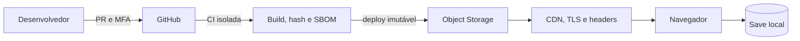

# Plano de Segurança da Informação

## 1. Escopo e princípios

O plano protege código, dependências, pipeline, site/jogo, releases, saves, contas administrativas e dados de pesquisa em eventual hospedagem cliente. O protótipo atual é offline, sem backend e sem telemetria.

Princípios: privacidade por padrão; coleta mínima; nenhum segredo no cliente; privilégio mínimo; MFA; builds rastreáveis; dependências verificadas; falha segura; atenção reforçada a menores.

## 2. Ativos e classificação

| Ativo | Classe | Proteção esperada |
|---|---|---|
| Código e docs | Público | integridade, autoria e disponibilidade |
| Release | Público controlado | hash, origem, imutabilidade e antimalware |
| Credenciais GitHub/cloud | Secreto | cofre, MFA, rotação, nunca versionar |
| Save local | Privado do usuário | validação e ausência de dados pessoais |
| Pesquisa agregada | Interno | anonimização e acesso limitado |
| Consentimentos | Confidencial | criptografia, retenção curta, acesso nomeado |

## 3. Arquitetura de confiança

A cloud recomendada serve um build WebAssembly estático por CDN, sem login ou API. O navegador e o save são não confiáveis; alterações locais nunca podem afetar terceiros.

Telemetria futura exige nova elicitação, avaliação de privacidade, base legal, retenção, API protegida e aprovação institucional.

## 4. Threat model

| Ameaça | Cenário | Controles |
|---|---|---|
| Falsificação | cópia se apresenta como oficial | aviso de não oficialidade, domínio e releases verificáveis |
| Adulteração | JS/WASM ou executável alterado | branch protection, PR, CI, artefatos imutáveis e SHA-256 |
| Repúdio | conteúdo alterado sem autoria | commits, reviews e trilha do GitHub |
| Vazamento | logs expõem menores | nenhuma telemetria no MVP, minimização e anonimização |
| Indisponibilidade | abuso do hosting | CDN, cache, alertas de custo e limites do provedor |
| Elevação | token de CI comprometido | OIDC temporário, ambientes protegidos e menor privilégio |
| Supply chain | dependência comprometida | versões fixadas, SBOM e atualização revisada |
| Save malformado | crash ou estado impossível | parser limitado, validação de faixa, versão e fallback seguro |
| Conteúdo incorreto | orientação desatualizada | revisão especializada e proprietário de conteúdo |

## 5. Baseline de controles

### Identidade e repositório

- MFA e contas individuais para mantenedores;
- `main` protegida, PR obrigatório e revisão para releases;
- segredos em cofre, preferindo OIDC de curta duração;
- secret scanning e revisão trimestral de permissões;
- tags semânticas, release com hash e SBOM.

### Desenvolvimento seguro

- compilação com avisos e análise estática C/C++;
- revisão de limites, ponteiros, arquivos, formatação e conversões;
- testes do progresso, vitória e save; fuzzing futuro do parser;
- dependências de origem confiável e versões registradas;
- checklist de segurança, conteúdo e acessibilidade em PRs.

### Aplicação e hosting

- não usar conteúdo do save como comando, URL ou caminho;
- validar versão, posição, integridade, progresso e quantidade;
- nenhum acesso a câmera, microfone, localização ou clipboard;
- TLS, CSP restritiva, `nosniff`, `Referrer-Policy`, `Permissions-Policy` e anti-framing;
- deploy versionado, rollback conhecido e logs mínimos.

## 6. Privacidade, LGPD e adolescentes

O MVP não coleta dados pessoais. Testes usam códigos aleatórios, resultados agregados e formulários separados. O jogo não solicita relatos reais. Se houver relato espontâneo, o facilitador segue protocolo institucional e não publica detalhes no GitHub.

Antes de piloto com dados: definir controlador, operador, finalidade e base legal; inventariar campos; avaliar consentimento e assentimento; produzir aviso claro; definir direitos e retenção; avaliar RIPD e aprovação ética; apagar dados após a finalidade.

## 7. Vulnerabilidades e incidentes

| Severidade | Exemplo | Resposta alvo |
|---|---|---|
| Crítica | execução remota ou segredo exposto | retirar versão e conter imediatamente |
| Alta | adulteração de conteúdo em produção | conter em até 1 dia útil |
| Média | crash por save manipulado | mitigar e corrigir no próximo ciclo |
| Baixa | informação sem impacto material | registrar para manutenção |

Fluxo: detectar, triar, conter, erradicar, recuperar, comunicar e realizar post-mortem sem culpabilização. Evidências exploráveis ou pessoais ficam fora de issues públicas.

## 8. Continuidade e gate de go-live

- fonte no GitHub e clone de contingência autorizado;
- releases versionadas, hashes e cloud como código;
- RPO do código: último commit integrado; RTO alvo do site: 4 horas;
- rollback testado para artefato anterior aprovado;
- aviso fictício e conteúdo revisado;
- nenhuma vulnerabilidade crítica/alta aberta;
- build reproduzível, SBOM, checksum, MFA, CSP e headers verificados;
- canal privado e responsável por incidente definidos;
- aprovação de privacidade se houver pesquisa ou telemetria.

## 9. Risco residual

Um cliente público pode ser copiado e modificado, e conteúdo educativo não evita todos os crimes. O produto deve evitar garantias absolutas, não culpabilizar vítimas e encaminhar o jogador a apoio humano adequado.
