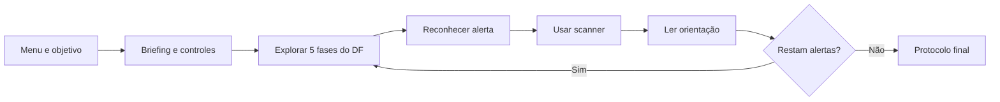

# Plano de UX/UI e Design System

## 1. Objetivo de experiência

O produto deve fazer o adolescente sentir-se capaz de reconhecer sinais de risco e tomar uma decisão segura, sem usar medo, culpa ou vigilância. A experiência-alvo é: **entendi a missão, identifiquei o risco, aprendi uma ação e consigo explicá-la**.

## 2. Público e contexto

- adolescentes de 12 a 17 anos com diferentes níveis de alfabetização digital;
- uso individual ou mediado por professor, em computador escolar ou doméstico;
- sessões de 10–20 minutos, com possíveis distrações e hardware modesto;
- usuários com baixa visão, daltonismo, dificuldade motora, atenção variável ou leitura mais lenta.

### Proto-personas

**Lia, 14:** usa redes e jogos diariamente, reconhece golpes óbvios, mas reage a urgência. Precisa de exemplos rápidos e linguagem sem julgamento.

**Rafael, 16:** domina tecnologia e tende a superestimar sua proteção. Precisa ver que engenharia social explora contexto, não “falta de inteligência”.

**Professora Marina:** tem 40 minutos e precisa contextualizar, observar a sessão e conduzir debate sem coletar relatos pessoais.

## 3. Jornada principal



Momentos críticos: compreender o scanner; diferenciar ameaça de decoração; ler sem perder o contexto; perceber progresso; recuperar-se de falha; concluir com síntese transferível ao mundo real.

## 4. Princípios de Material Design adaptados

1. **Hierarquia visível:** uma ação primária por tela e progresso sempre localizável.
2. **Feedback imediato:** hover, foco, scanner, dano e conclusão usam movimento curto, cor e texto.
3. **Superfícies e elevação:** painéis separam informação educativa do cenário sem esconder contexto.
4. **Consistência:** mesmos tokens, espaçamentos, estados e linguagem em menu, HUD e alertas.
5. **Acessibilidade antes de decoração:** cor nunca é o único sinal; texto e ícone permanecem legíveis.
6. **Movimento com propósito:** animações explicam causa/efeito; modo de redução de movimento é requisito futuro P1.

## 5. Design System “Cibersegura”

### Tokens de cor

| Token | Hex | Uso |
|---|---|---|
| `navy-900` | `#081F3A` | fundo de painel e texto sobre claro |
| `blue-700` | `#184877` | ação e identidade do projeto |
| `cyan-400` | `#37E5C1` | sucesso, scanner e foco |
| `yellow-400` | `#FAC32D` | atenção e progresso |
| `red-500` | `#D7364F` | risco/erro, sempre com texto ou ícone |
| `sky-300` | `#66BEE8` | céu e superfície lúdica |
| `neutral-050` | `#F4F7F8` | texto claro e cartões |

Contraste deve atingir WCAG 2.2 AA: 4,5:1 para texto regular e 3:1 para texto grande/elementos gráficos. Validar combinações no build final; não assumir conformidade apenas pela tabela.

### Tipografia e ícones

- jogo atual: fonte padrão pixelada da raylib, com tamanhos mínimos definidos por tela;
- evolução: fonte bitmap licenciada, com suporte a acentos e alternativa de alta legibilidade;
- frases curtas, voz ativa e um conceito por linha;
- ícones acompanhados por rótulo: scanner, alerta, proteção, progresso e evidência.

### Espaçamento e formas

- escala de 4 px; unidades usuais: 8, 12, 16, 24, 32 e 48;
- alvo interativo mínimo: 44×44 px;
- raio de painéis/botões: 8–16 px;
- borda de foco: 3 px em ciano ou branco, sem depender apenas de hover.

## 6. Componentes e estados

| Componente | Estados obrigatórios |
|---|---|
| Botão | padrão, hover, foco, pressionado, desabilitado |
| Barra de proteção | normal, atenção, crítico, texto percentual |
| Cartão educativo | título do risco, três ações, progresso e comando de saída |
| Marcador de ameaça | nome, forma distinta e feedback de scanner |
| Toast | sucesso/erro, duração suficiente, sem informação exclusiva |
| Modal de pausa | foco contido, retorno previsível, salvar e sair |

## 7. Arquitetura de informação

```text
Menu
├── Iniciar missão
├── Como jogar
├── Continuar
└── Sair
Missão
├── HUD: proteção, fase atual, controles e progresso
├── Mundo: 5 fases, pontos do DF, plataformas e alertas
├── Orientação por categoria
└── Pausa: continuar, salvar, menu
Resultado
├── Missão cumprida + protocolo
└── Missão interrompida + recuperação
```

## 8. Conteúdo e tom

- usar “você pode” e ações concretas; evitar “você deveria saber”;
- dizer “violência digital não é brincadeira”, sem descrever conteúdo traumático;
- não prometer que denunciar ou bloquear elimina o risco;
- diferenciar preservação de evidências de compartilhamento público;
- indicar adulto de confiança e ajuda especializada para situações sensíveis;
- manter aviso de projeto acadêmico não oficial.

## 9. Acessibilidade e inclusão

Meta: WCAG 2.2 AA quando houver versão web, adaptando os critérios aplicáveis ao jogo.

- teclado completo e foco visível;
- remapeamento de ações e alternativa a pressões rápidas;
- alto contraste, redução de movimento e controle de volume futuros;
- legendas/texto para toda informação sonora futura;
- não depender de vermelho/verde;
- tempo de leitura controlado pelo jogador;
- linguagem simples e suporte correto a português brasileiro;
- teste com leitores de tela na camada HTML da versão web, oferecendo descrição e controles equivalentes quando o canvas não for acessível.

## 10. Plano de pesquisa

### Teste formativo (5–8 participantes)

Tarefas: iniciar sem instrução verbal; localizar primeiro alerta; explicar a orientação; salvar e retomar; concluir ou interpretar o progresso. Registrar erros, hesitações, pedidos de ajuda e compreensão — nunca conteúdo de contas reais.

Perguntas finais: “O que você faria antes de clicar?”, “Qual alerta foi menos claro?”, “Em que momento você se sentiu perdido?”, “O jogo pareceu culpar alguém?”. Aplicar SUS somente após a tarefa.

### Critérios de aceite UX

- 80% iniciam e usam o scanner sem ajuda;
- 90% localizam progresso e proteção;
- nenhuma orientação depende apenas de cor ou tempo;
- pelo menos 80% explicam corretamente duas ações preventivas;
- nenhum bloqueador de teclado permanece aberto para release;
- problemas com impacto em segurança ou compreensão têm prioridade P0/P1.

## 11. Próximas melhorias priorizadas

P1: fonte com acentos; remapeamento; alto contraste; redução de movimento; quiz final; feedback visual antes do contato. P2: áudio opcional, guia do facilitador e teste de responsividade. P3: personalização cosmética sem coleta de perfil.
